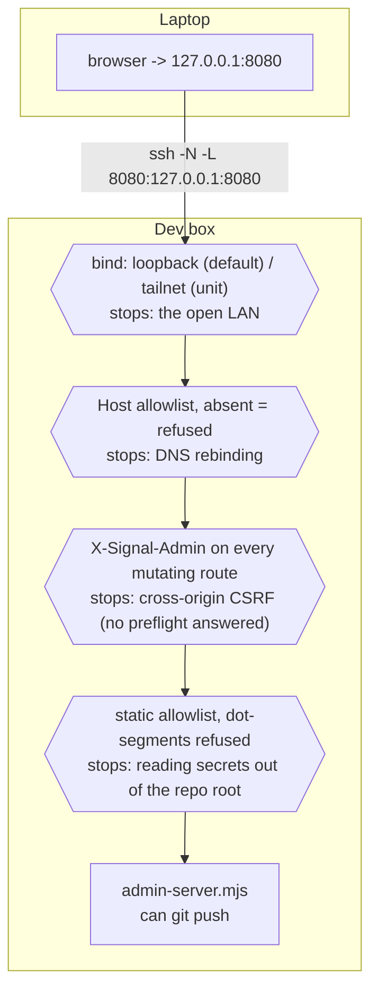
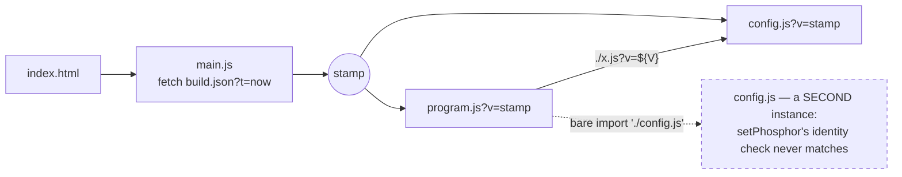
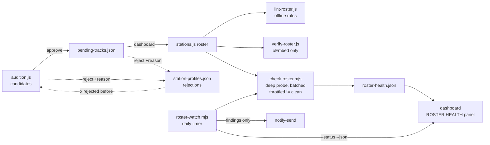

# CLAUDE.md

This file provides guidance to Claude Code (claude.ai/code) when working with code in this repository.

Map of this file (45KB — jump, don't scroll):

- **What this is** / **Commands** — product intent pointer, every npm script.
- **The admin backend** — the dashboard server, its guards, SSH/tailnet access.
- **Architecture** — bootstrap + module identity, engine vs. app, the modules,
  cross-file invariants (layout, stations, tuning distance, effects queue).
- **Tests** — the harness, its fakes and their capture discipline, mutation
  checks, the dead-feedback sweep.
- **Weather / Synced lyrics / Voice clips** — the three subsystems with rules
  that look optional and are not.
- **Conventions** — comments as design record, roster/content-ops rules, the
  health tooling, screenshots, browser-verification traps.

## What this is

SIGNAL — a CRT/terminal internet-radio web toy. A tuning-dial receiver rendered
entirely through a text grid, playing real YouTube tracks from 13 curated
stations across two bands. Read `README.md` first: it carries the product
intent, the controls reference, and the content-ops rules that constrain what
may be added.

## Commands

No build step, no dependencies. `package.json` exists only to mark the repo
`"type": "module"` (so Node runs `stations.js`, `tools/`, `tests/` as ESM) and
to name these scripts:

```bash
node tools/admin-server.mjs         # npm run admin — the admin backend + the app, port 8080
python3 tools/dev-server.py 8000    # dev server (no-store headers); open http://localhost:8000
node --test tests/*.test.mjs        # npm test — headless suite, ~11s, no network
node tools/lint-roster.js           # npm run lint — offline roster rules
node tools/verify-roster.js         # npm run verify — lint + oEmbed check of every track (network)
node tools/check-roster.mjs         # npm run health — deep-probe roster tracks in batches (network)
node tools/lyrics-audit.mjs         # npm run lyrics — measure [L]'s LRCLIB match rate (network)
node tools/roster-watch.mjs         # npm run watch — one scheduled health batch; --status, --dry-run
node tools/stations-to-md.js        # npm run stations — regenerate stations.md (never hand-edit it)
node tools/stamp.js                 # npm run stamp — bump build.json; RUN BEFORE EVERY DEPLOY
node tools/audition.js --station=<id> # npm run audition — vet candidate tracks (network)
node tools/voice-render.mjs         # npm run voice — render a voice clip (network, costs credits)
node tools/shoot.mjs                # npm run shoot — regenerate screenshots/ (headless Chrome + ImageMagick)
node tools/dead-feedback.mjs        # npm run deadfeedback — input-feedback sweep (headless, ~1min)
```

`file://` does not work — the BDF font fetch needs a real origin. Use
`tools/dev-server.py`, not `python3 -m http.server`: only the former sends
`Cache-Control: no-store`.

**Deploys need `node tools/stamp.js`.** `main.js` fetches `build.json`
(always fresh, `?t=`) and imports every app module as `?v=<stamp>`; without a
bump, GitHub Pages' 10-minute cache can keep a visitor on the previous build.
The **audio assets carry the same stamp** (2026-08-29, `clipUrl()` in
`audio/voice.js`) — they did not until a re-rendered station ID was live,
byte-identical on the server, and the browser went on playing the old one.
Adding a clip never exposed it; a URL nobody has fetched cannot be stale.

## The admin backend

`node tools/admin-server.mjs` (`npm run admin`) serves the app AND the
network-ops dashboard at `http://127.0.0.1:8080/admin`. It sends the same
`Cache-Control: no-store` headers `tools/dev-server.py` does, so for an admin
session it replaces that server rather than running beside it. Zero
dependencies; binds loopback, checks the `Host` header, requires an
`X-Signal-Admin` header on every mutating route — which a cross-origin page
cannot send without a CORS preflight this server never answers — and serves
static files from an **allowlist**, not the whole repo. That third guard is
not decorative: this process can run `git push`.

**On the development box it is already running, as a systemd USER unit** —
`tools/signal-admin.service`, a reference copy of what is installed at
`~/.config/systemd/user/`. So the first thing to know is that
`npm run admin` will fail with `EADDRINUSE` while the unit holds the port:
the answer is almost never to start one, it is to restart the one that is up.

```bash
systemctl --user status signal-admin
systemctl --user restart signal-admin          # after editing admin-server.mjs
journalctl --user -u signal-admin -f
systemctl --user disable --now signal-admin    # stop it coming back
```

**A code change to `tools/admin-server.mjs` does not take effect until that
restart.** `tools/network.html` needs no restart at all — `serveStatic()`
re-reads from disk per request under `no-store` — which makes the split easy
to forget in the direction that wastes the most time: the page updates on a
reload, the routes it is calling do not. The *data* the routes serve is a
third case since 2026-09-02: `bootState()`'s imports of tuning/visuals/
config/lint-roster are keyed on each file's mtime, so the dashboard's limits,
glyph and visual lists refresh on the next `/api/state` without a restart —
only route *code* still needs one.

The unit carries its own reasoning in its comments (why it binds the tailnet
rather than loopback, why `Restart=always` with no start-rate limit, why the
mise *shim* rather than the version-pinned node path) and is the authority on
all three; read it before changing how the service runs. Note it is bound to
the tailnet, not loopback, unlike the default described above — this box is
worked on over SSH, and the two ways across are covered below.

**This box is normally worked on over SSH, where `127.0.0.1:8080` names the
laptop, not this machine** — which is exactly how the first live check of the
dashboard failed, with a browser error page against a server `curl` could
reach fine. Loopback is still the default, because `tools/dev-server.py`
binding every interface is a different risk from this one doing it: that
serves static files, this commits and pushes. Two ways across:

- **Tunnel** (nothing exposed): `ssh -N -L 8080:127.0.0.1:8080 <user>@<box>`,
  then open `http://127.0.0.1:8080/admin` on the laptop. In a live session,
  `~C` then `-L 8080:127.0.0.1:8080`. The banner prints this command, filled
  in with the real port and address, whenever `SSH_CONNECTION` is set.
- **`--host=<addr>`** (`npm run admin -- --host=100.x.y.z`) binds an
  interface the other machine can see; a Tailscale address is the defensible
  one, since that is an authenticated mesh rather than the open LAN. It
  prints a warning saying what it just allowed, and there is no password.

Either way the `Host` allowlist stays on: every address this machine actually
has, plus the loopback names, and nothing else. That still stops DNS
rebinding, which needs the browser to send `Host: evil.com` — a hostname an
attacker controls is not in the set however it resolves.

The trust boundary, as one picture — each guard annotated with the attack it
stops (2026-09-02 audit; the four paragraphs above are the authority, this is
the shape of them):



**The static allowlist (2026-09-02) is the one guard here that was actually
exploited rather than merely thin.** The server maps URLs onto the repo
ROOT, and the repo root is a working directory: `curl
http://<tailnet-addr>:8080/.elevenlabs-key` returned 200 and the key, and
`tools/dev-server.py` was worse while running — it binds every interface, so
the same file went to the open LAN. `.gitignore` had kept the key out of
git; nothing had kept it out of HTTP.

The fix is an allowlist rather than the obvious dotfile denylist, and that
choice is the point: a denylist has to anticipate `.env`, editor swap files,
`*.pem`, a stray `stations.js.bak`, whatever the next secret is called,
whereas naming what the app actually fetches means the next secret dropped
in this directory is safe because nobody had to remember it. `servable()` in
`tools/admin-server.mjs` carries the rules and the reasoning; `dev-server.py`
holds a deliberate second copy of the same shape, and the comment in each
points at the other — change one, change both. What it allows was derived by
enumerating real fetches, and two of them are non-obvious: the dashboard
imports `/tools/lib/roster.mjs`, and `audition.js` prints an **http** URL for
its generated `tools/audition.html`, so both of those workflows break under
a naive "serve nothing from tools/" rule. `tests/admin-server.test.mjs`
asserts from both ends — the secrets 404, and the dashboard's own imports
still 200 — because an allowlist that serves nothing passes the refusal half
on its own.

`tools/network.html` was serverless until 2026-08-27, reading and writing
`stations.js` through Chrome's File System Access API with the roster parser
copied inline. **Opening the file directly no longer works** — a `file://`
page cannot import a sibling module, and re-inlining the parser is the exact
duplication that broke this dashboard once before. Its connect screen says
so and prints the command.

What the served version does that the file could not:

- **Run the Node toolchain** and stream it back: lint, the suite, verify,
  stamp, stations.md, the dead-feedback sweep, screenshots. PREFLIGHT chains
  lint → suite (roster verify is opt-in — it is the slow, networked one).
- **Edit a station's IDENTITY** — `crt`, `meter`, `ident`, `glyph`, `visual`,
  `static`, `freq`, tagline, desc. Nothing but a hand-edit of
  `stations.js` could touch any of these before. Ident tones play through the
  same chain `playIdent()` uses; the tagline counter and the glyph-in-font
  check are the rules `lint-roster.js` already enforces, read from the server
  rather than restated here.
- **SHIP**: stamp → stations.md → lint → suite → add → commit → push,
  stopping at the first failure with nothing committed. The stamp step is the
  one most easily forgotten by hand, which is the whole argument for it.
- **Audition in the browser**, wrapping `tools/audition.js --json`.
- **A live receiver** in an iframe beside the sliders, via `?station=<id>`.

`tools/lib/roster.mjs` is the stations.js parse/patch layer, imported by BOTH
the server and the page — which is why it has no `node:` imports at all. Add
one and the dashboard stops loading. Two patchers:

- `patchStationTracks()` rewrites a `tracks: [...]` block, carrying each
  track's comment block across with it, keyed by `youtubeId`. It used to
  regenerate the array from data and **strip every comment in it** — which
  was tolerable while the block was only hand-edited, and stopped being
  tolerable the moment the dashboard made removing a track two clicks. The
  first real use of that button destroyed 33 lines of "Nth pass" notes (two
  stations' batch-approval record, an issue-#19 swap rationale) as a side
  effect of dropping two tracks, and nothing else holds those notes. Fixed
  2026-08-27. A comment attached to a track you *removed* still goes with it
  — usually correct — but the caller gets `droppedComments` back and the
  dashboard prints it, so it is never silent again. Indentation and quote
  style are inferred from the block, not imposed: GREEN ROOM indents entries
  4 spaces where every other station uses 6, and `'Don\'t Go'` must not come
  back as `"Don't Go"`.
- `patchStationField()` rewrites ONE field's value and leaves every other
  byte alone, comments included. This is what makes the identity editor safe
  to have at all: those fields are wrapped in the "Nth pass" notes that are
  this repo's design record, and a reformat-the-object patcher would eat them
  the first time anyone dragged a slider. It infers numeric and quote style
  from the literal it replaces — `identTempo: 1.0` must not come back as
  `identTempo: 1`,
  and a single-quoted freqNote must not come back double-quoted.

`tests/roster-lib.test.mjs` guards **both** patchers with an **idempotence
sweep**: rewriting every field, every nested leaf, and every tracks block of
every station with the value it already has must give the file back byte for
byte. The tracks half of that sweep scored 1/11 when it was first written —
that is what the comment-stripping looked like as a number. That is what caught
both style bugs above. It did *not* catch a trailing-space bug on the last
key of an inline object (`bloomAmt: 2.0}`), because the sweep rewrote `crt`
as a whole object where the space cancels out on both sides — a headless load
of the dashboard caught that one, in the diff preview, and nested leaves are
in the sweep now. The dashboard's "preview change" button runs these same
patchers client-side and shows the diff before you save, which is the only
honest proof that a save touches only what it claims to.

## Architecture

### Bootstrap

`index.html` → `main.js` (reads the build stamp, imports `config.js` and
`program.js` as `?v=<stamp>`) → `src/screen.js` `mount(canvas, program, config)`
→ `Term` + `CRT` + rAF loop → `program.frame()` every frame.

**Module identity matters.** A module is instanced per full URL, query string
included. Every app module imports its siblings with the same
`` `./x.js?v=${V}` `` form (`V = globalThis.SIGNAL_BUILD`), so there is exactly
one instance of each. A bare `import './config.js'` would create a second
instance — that exact mistake once defeated the engine's `setPhosphor`
identity check. Keep the pattern when adding a module; the import graph must
stay acyclic (top-level `await import` deadlocks on a cycle).



### Engine (`src/`) vs. app

`src/` is `cyberspace-crt`, a generic WebGL2 CRT text-grid engine (vendored,
MIT). It knows nothing about radio and imports nothing from the app; it takes
its config through `mount()`. Prefer solving things in the app.

- `cellgrid.js` — char/attr/inverse/`gfx` planes with **per-row dirty
  tracking**; `put()` is a no-op for an unchanged cell. Attribute bits:
  `NORMAL BRIGHT BOLD DIM ALT ITALIC MUTED FAINT BG`.
- `term.js` — rasterizes only dirty rows into a single-byte beam-intensity
  framebuffer and returns the changed pixel bands; colour is applied in the
  shader, so tint changes never re-rasterize.
- `crt.js` — the WebGL2 passes; `crt.params` is a live object the app mutates;
  `setPhosphor(name)` no-ops when the tint is already up (persistence clear
  otherwise). Band uploads; `ResizeObserver` instead of per-frame layout reads.
- `screen.js` (only DOM-touching file), `bdf.js`, `vector.js`.

### App modules

`program.js` is the state machine: the effects queue, `init`, power on/off,
the YouTube player, tuning/lock, scan/presets, persistence glue, `key()`,
`frame()`. It composes the rest as **mixins** (`...desktopUi, ...mobileUi,
...guide, ...visualizer` — plain objects of methods where `this` is the
program):

- `ui/desktop.js` — the 80x25 screen: chrome, dial, status row (typewriter
  reveal, sweeps, flashes), text resolves, meters, antenna pane, STANDBY
  splash, idle CRT events. `ui/mobile.js` — the 42x22 lite screen and touch
  gestures. `ui/guide.js` — the `[G]` overlay.
- `visualizer.js` — shell (enter/exit, footer, cycling, lyrics view) that
  dispatches into `visuals/<key>.js`, each `{ key, label, init(p, term),
  reset(p), draw(p, s, t) }`; `visuals/index.js` is the registry in `[V]`-cycle
  order; `visuals/shared.js` holds the density ramp / hash / level→attr helpers.
  Effect state lives on the program object under `_`-prefixed names; `init`
  seeds it at boot, `reset` re-arms clocks on every visualizer entry (the
  effect clock restarts at 0 — an absolute `t` kept across visits froze FLAME
  once).
- `audio/sfx.js` — AudioContext, the hard-mute speaker bus, static bed, hum,
  every synthesized control sound. `audio/voice.js` — station IDs, liners,
  welcome line (one shared "through the radio" chain), LRCLIB lyrics.
  `audio/tap.js` — the live audio tap and `AUDIO_BUS`, plus `auMul` /
  `syntheticAudio` / `SILENT_AUDIO`. The **voice duck** (2026-08-29) pulls the
  music down 50% under a station ID or a liner drop, and is the one piece of
  level control that cannot be a gain node: the music is YouTube's iframe and
  is not in the WebAudio graph at all, so it has to be `player.setVolume()`,
  stepped on a real timer to make a ramp the API does not provide. It lives in
  `program.js` beside `applyVolume()` — every path that sets a level goes
  through that one function, which is what keeps the duck, the sleep fade and
  the listener's own volume multiplying instead of overwriting each other. The
  network sign-on line deliberately does NOT duck; it plays over a boot with
  no track under it.
- `stations.js` — the roster, pure data, no imports (Node can import it).
  `layout.js` — desktop + mobile row/column constants, STANDBY layout, text and
  box helpers. `tuning.js` — the band, thresholds, `freqToCol`, the three
  nearest-station questions, shuffle bag. `crt-hooks.js` — `crtBase`, distance
  degrade, ramps, glitch/bloom/focus-snap. `constants.js`, `state.js`.
- `game.js` — VECTOR SCAN (2026-08-29), a Gradius, reached by entering the
  Konami code inside the visualizer. It is a THIRD VIEW on the visualizer's
  canvas, beside the effect and the `[L]` lyrics view — not a fourth
  top-level overlay — so it inherits every paint guard the visualizer
  already has rather than needing its own. Deliberately absent from the
  README, the guide, and every on-screen legend: the way in is the whole
  point of it, so treat "undocumented to the listener" as a feature with a
  test behind it, not an oversight to tidy up. Listed here because a module
  nothing mentions is a module someone breaks by accident.

  It is the only thing in the app that draws through `src/vector.js` (the
  Braille dot canvas — the character grid as a 160x76 framebuffer), and the
  only thing that needs a key's *held* state, which is why `program.keyUp()`
  exists at all after screen.js forwarded `keyup` to nothing for its whole
  life. Its own comments carry the reasoning; two things worth knowing from
  outside it are that the arcade power meter is drawn as TEXT (a row of
  labelled boxes is the one part of Gradius a terminal renders better than a
  framebuffer, and is the argument for this game over another), and that the
  simulation runs on a fixed 60Hz step rather than the frame delta.

  Three things landed 2026-08-30 and two of them reach outside the module.
  The **stage break** — a clear corridor, a scroll surge and a banner where
  one stage becomes the next — cuts its gate at a WORLD COLUMN rather than
  off the break's countdown, because terrain here is a pure function of the
  column and a corridor in the same coordinate scrolls correctly however
  fast the surge is running. `terrainAtGate()` is called by **both** the
  collision test and the draw, and that pairing is the thing to preserve:
  gating only the drawing yields open sky with the rock still solid in it,
  which looks perfect in a screenshot and is unplayable. A test holds it.
  The **meter wipe** empties the power boxes left to right on death, and
  changes only cell ATTRIBUTES — a test that reads the characters back
  cannot see it at all. The **high score** is the game's one persistent
  trace and therefore spans three files: `program.gameHiScore`, a field in
  `state.js`'s payload, and the two call sites in `game.js` that commit it
  (game over *and* walking out with `[E]` — a record that only counted when
  you died would keep the bad runs and discard the good ones).

### Things that only make sense across files

- **Layout is absolute cell coordinates** (`layout.js`); no layout engine.
  `MOBILE_LITE` is decided once at `config.js` import from `matchMedia`, so the
  grid is fixed for the page's life and mobile has parallel `mobile*` draw paths.
- **A station is an identity object** (`stations.js`): `freq callsign tagline
  desc freqNote ident identTempo glyph static crt meter idleEvent grind
  visual tracks`; secret stations carry `secret: true` and `forcedPhosphor`
  and are read generically — don't reintroduce id comparisons.
- **Adding a secret station** is five edits and no new call sites, because
  `SECRET_STATIONS` is walked rather than indexed and every secret behaviour
  keys on `station.secret` / `station.forcedPhosphor`: the object literal in
  `stations.js`, one entry in `SECRET_STATIONS`, one `case` in `program.js`'s
  `key()` calling `presetTune()` on the object directly, the key in
  `MAPPED_KEYS` (else it's the one command that lands with no click), and the
  tint in `config.js`'s `PHOSPHORS`. **A `forcedPhosphor` that isn't in
  `PHOSPHORS` fails silently** — `setPhosphor()` no-ops on an unknown name, so
  the station just never changes colour and nothing throws.
  `tests/helpers.test.mjs` guards that. Don't force a tint the tube may
  already be in either (`setPhosphor()` no-ops on an identical tint, so the
  reveal lands as nothing happening for anyone already in that mode).
- **Tuning distance is one shared quantity** feeding the static bed
  (`staticGainForDist`), the S/N readout and the CRT degrade
  (`crtDegradeForDist`), so what you hear, see and read agree by construction.
- **The effects queue** (`program.fxAfter/fxEvery/fxTween/fxCancel`): every
  deferred draw or `crt.params` change goes on it, never on `setTimeout`. The
  normal queue ticks only while powered on with no guide up, so nothing can
  paint through an overlay; `powerDown` empties it; cancelled tweens settle at
  their end value. The always-queue is for the power sequences only. A
  250ms fallback ticker drains the queues whenever `frame()` hasn't run in
  200ms — keyed on rAF starvation, never on `document.hidden` (a background
  window on Wayland is throttled but reports `visible`). What stays on real
  timers on purpose: audio scheduling, the scan/preset sweeps, the clock.
- **Playback** is the YouTube IFrame API into an off-screen `#ytDock`;
  `index.html` defines `SIGNAL_YT_QUEUE` before the API loads. Every effect
  must look right with **no** audio tap (`this._au || syntheticAudio(t)`,
  `SILENT_AUDIO` while muted) — declined capture is common, not an edge case.

## Tests

`tests/harness.mjs` boots the real `program.js` in Node against a real `Term`
+ real BDF font, a stub `crt` with a live `params` object, and a **fake
clock**: `performance.now`, `Date.now`, `setTimeout`/`setInterval` all move
only via `h.advance(ms)`, which ticks `program.frame()` every 16ms. Tests
press keys (`h.key`), tap/swipe (`h.tap`, `h.swipe`), and assert on the text
grid (`h.row(y)`, `h.find(text)`). `boot({ mobile: true })` forces the lite
layout. Each boot gets fresh module instances (unique `?v=`). Add a scenario
here when you change a state transition; add to `tests/helpers.test.mjs` for
pure helpers; `tests/roster.test.mjs` runs `tools/lint-roster.js`.

One trap when writing scenarios: **a fresh boot lands on a random station**,
and pressing the preset you are already on is a no-op flash rather than a
re-tune — so a hardcoded `h.key('3')` quietly does nothing about one run in
nine. Ask `otherPreset(h)` for a digit that isn't the current station.

`boot({ player: true })` adds a **fake YouTube player** — the real API surface
is ten methods and three events, so the harness models it rather than stubbing
it: position runs on the same fake clock, `seekTo`/`pause`/`play` move it, and
the state events fire on a timer the way the real ones do. Without it there is
no player at all and `loadTrack()` returns on its first line, so every test
written before 2026-08-27 exercised the tuning half with playback switched
off. `h.player.endTrack()` and `h.player.fail()` cause the two events a test
cannot otherwise reach (a natural track end, a dead video). `boot({ lyrics })`
answers the LRCLIB lookup — `true` for a canned synced lyric, a raw LRC string
for your own, `'none'` for no match, `'search'` to make `/api/get` miss so only
the fallback can answer, `'mismatch'` for a real synced lyric belonging to a
recording of visibly the wrong length, or a function of the URL when one track
should have them and the next should not. That chain is a real promise chain
and `advance()` is synchronous, so `await h.flush()` after the load that fires
it. The fake models **both** endpoints as the live API really answers them
(captured 2026-08-30): `/api/get` returns one object or a **404**, `/api/search`
returns an **array**, ordered by the server's relevance and *not* by duration.
It carries `duration` deliberately — a fake that omitted it would pass every
duration gate by accident and make those tests decorative.

**A fake proves you read your own assumption correctly — nothing more.**
This is the expensive lesson of the STATION BREAK, which took three passes
and shipped twice before it was learned. The harness modelled a YouTube
preroll the way the IFrame API was *assumed* to report one — `getVideoData()`
naming the ad, `getDuration()` giving the ad's length — and a detector built
on exactly those assumptions passed its tests every time. A capture from a
real preroll then showed the player reports the *requested* video's own id
and own duration throughout, so there was never anything to detect and the
suite could not have told you: it was asking the fake to confirm the belief
that built it. When a fake stands in for something outside this codebase,
green means self-consistent, not correct. Anything load-bearing about the
external thing's real behaviour has to come off the real thing once, and
then the fake gets rewritten from that capture rather than from the spec —
`tests/harness.mjs`'s advert model carries the reading it was rebuilt from,
so a future detector on ids or durations fails there as it would live.

**Mutate the code to check a test can fail.** The same pass shipped an
anti-flash test that was decorative: forcing `BREAK_HOLD_MS` to 0 — a break
firing on every ordinary track change, the exact bug it existed to catch —
left it green, because the fake started playback at 0ms and gave it no
window to catch anything in. Breaking the feature on purpose is what found
that, and the fix was in the harness (content now takes a realistic 700ms to
start), not the test. Worth doing for anything timing-shaped: neuter the
behaviour, confirm the suite goes red, and check the *right* tests went red.

`tools/dead-feedback.mjs` drives the same harness as a **sweep** rather than
as assertions: every key in every view, each pressed run diffed against a
do-nothing control run from the same PRNG seed, so a key that changes nothing
anywhere on the grid shows up as such. Run it after touching `key()`,
`isMappedKey()`, `MAPPED_KEYS`/`VISUALIZER_KEYS` or the touch gestures. Two
rules it exists to keep: a key that CLICKS has to change something (the click
is gated by `isMappedKey`, which is meant to mirror what `key()` actually
answers — it drifted out of sync in the visualizer for four passes), and a
control the screen advertises — footer hints, the Guide's grid, the
visualizer legend — has to answer even where it can't act (`NO SIGNAL`,
`NO HISTORY`, `NO LINE IN`). Its header documents the seeding, the `[F]`
exception and the `F13` canary that catches a desynchronised run.

### Weather ([W])

`weather.js` is the data half (pure: bucketing, the WMO code tables, the unit
call, the card's own copy) and `ui/weather.js` is the drawing half. The split
is what lets the bucketing be tested in Node — a drawing bug is visible the
moment you look at the screen, a bucketing bug puts the afternoon's weather on
the morning line and looks entirely plausible.

Two things about it are load-bearing and easy to undo by accident:

- **The card does NOT clear the grid**, unlike the guide and the LINE INPUT
  card. Weather is an aside, not a destination — the dial above and the meters
  below stay lit underneath it. The cost is that it cannot rely on the
  "nothing else may paint" contract the full-screen overlays get, so
  `weatherOpen` has to appear in the same paint guards as `guideOpen` and
  `tapConsentOpen`. Miss one and the track title draws through the card.
- **Geolocation needs a secure context.** On plain `http` the API exists, the
  call runs, and the error callback fires with code 1 — `PERMISSION_DENIED`,
  the same code a real refusal gives — saying "Only secure origins are
  allowed". Those two must not be conflated: a refusal is persisted, so
  treating an insecure origin as one would remember a visitor as having
  declined forever, on every origin. `canLocate()` separates them. In
  practice this means **the feature cannot be exercised over the Tailscale
  IP** — use `localhost` or the deployed site.

Widths are asserted rather than trusted, because both failed once in a real
render: card copy over 48 columns writes through the box's right border, and
the row-0 readout is right-aligned to end at column 63 because starting it at
52 rendered as `SIGNAL RECEIVER69F CLEAR`, flush against the brand plate.

### Synced lyrics ([L])

The lookup lives in `audio/voice.js`, the crawl in `visualizer.js`'s
`drawLyricsView`. LRCLIB is the only source and that is not laziness: it is
the only keyless, CORS-open, *time-synced* provider going. Plain-text APIs
can't do the one thing this feature is for, and the alternatives need a key
and a proxy. The real second source, if a track ever justifies it, is a
bundled `.lrc` in the repo.

**Everything here was measured, not reasoned** — `npm run lyrics` samples the
roster against the live API and reports the match rate. First measured
2026-08-30, on 101 tracks across 11 stations: the original lookup (one
`/api/get` on the raw title) resolved **59%**, and the `/api/search` fallback
took it to **76%**. Re-run it after touching any of this rather than trusting
those numbers.

**Re-measured 2026-09-02, and the headline fell to 30% → 53% on 120 tracks
across 15 stations. Nothing regressed.** The four ambient/instrumental ZM
stations added since — THE CRYPT, DRIFT MODE, SLOW ORBIT, TRADEWINDS — scored
**0/8 each, 0/32 in total**, which is the correct answer for wordless music
and not a matcher problem. Excluding those four the rate is 63/88 = **72%**,
in line with the original 76%. The fallback's own contribution went *up*
(+17pp then, +23pp now).

The lesson for the next re-measure: **the headline rate is a property of the
roster's mix, not of the lookup.** Compare it against the ceiling a roster of
that composition can reach, or a curation pass toward instrumental music will
read as a code regression and send someone hunting a bug that is not there.
The practical consequence is that `[L]` on those four stations is `NO LYRICS
AVAILABLE` essentially always — which is honest, and is what the duration gate
below exists to keep true.

Three things that look optional and are not:

- **A search result is not a match.** LRCLIB orders by its own relevance, so
  for several roster tracks the top synced hit is a *live* cut whose timings
  fit nothing. `pickLyricMatch()` ranks by closeness to the length actually
  playing. Taking row zero is the bug this exists to prevent.
- **The duration gate is the sync half.** Fourteen sampled tracks already
  matched a recording of visibly the wrong length — a 277s lyric against a
  166s upload, a 224s one against 416s — and rendered as confident drift. Past
  `LYRIC_DURATION_TOLERANCE` the answer is refused, because `NO LYRICS
  AVAILABLE` beats lyrics that disagree with the song. Two causes hide in that
  gap and nothing separates them automatically: a different recording
  (unfixable) and an upload with lead-in padding (would need a per-track
  offset, not built).
- **The duration is 0 when `loadTrack()` asks.** So the first answer is ranked
  and gated against nothing, and the PLAYING handler asks once more with the
  real length; `rankedBy` on the cache entry is what stops that looping.

Two smaller rules. A dropped request is `'error'` and retryable, *not*
`'unavailable'` — both used to write the same permanent verdict into a cache
keyed by `youtubeId`, so one flaky request cost that track its lyrics for the
whole session. And `parseLRC` **keeps blank tags** as sentinels: an empty tag
ends a sung passage, and dropping them left the previous line lit at full
brightness through an instrumental, still claiming to be current.

**Title normalisation was tried and rejected on the evidence.** The roster's
decorations (`Piggy (VEVO Presents)`) genuinely do 404 on `/api/get`, so
stripping them looks obviously right; measured, it recovered *nothing* the
search fallback hadn't already caught. The strategy is still in the audit tool
so the claim stays checkable — don't re-add it to `voice.js` without a number.

### Rendering a voice clip ([W]-adjacent, but its own thing)

`tools/voice-render.mjs` calls ElevenLabs directly, so a new station ID or
liner does not need the web UI, a download and a rename. The settings live in
`tools/lib/voice-settings.mjs` and are the same ones `audio/voice.js`'s
provenance block documents — `tests/voice-render.test.mjs` asserts the two
agree, because they are two copies of the same numbers and the alternative to
asserting is finding out when a clip comes back sounding wrong.

The reason it exists is not typing saved. It is that the two checks happen
*between* the render and the file existing:

- **Trailing silence** is padded to ~0.5s when short. Safe to automate: it
  appends digital silence and alters no audio.
- **Peak level** is reported against the band the existing set occupies and
  deliberately NOT corrected — normalising changes the recording, and a hot
  take is better fixed by taking it again. SYNAPSE's ID is the standing
  example of both failures at once.

Nothing renders without `--yes`; `--dry-run` prints the script and spends
nothing. The frequency is the part that goes wrong and the part nobody
proofreads, so the script is always printed first. Digits must be spelled
out — handed `567.8` the renderer says "five six seven point eight", which is
not how a station reads its own frequency; `spokenFrequency()` handles that,
including HACKBACK's "eight oh eight", the one shape on the dial that a naive
implementation reads as "eight eight".

The key is read from `ELEVENLABS_API_KEY` or a gitignored `.elevenlabs-key`,
never from an argument — an argument lands in shell history and the process
list.

## Conventions

- **The comments are the design record.** Nearly every decision carries an
  "Nth pass" note explaining what was tried, what broke, and why the current
  shape won. Preserve them when editing nearby code and add the same kind of
  note for non-obvious changes — much of the rationale exists nowhere else.
  The corollary: reasoning belongs **next to the code it governs**, and not
  copied into a doc, a commit message, or an assistant's memory, all of which
  are free to drift from it. Where something genuinely must live in two
  places, make one of them assert they agree rather than trusting them to:
  `lint-roster.js`'s `TAGLINE_MAX` duplicates the width of the guide index's
  LANE column, and `tests/program.test.mjs` fails if the two diverge. The
  cautionary case is already further down this file — "Rejections live in two
  files and neither reads the other" is what the un-asserted version of this
  looks like a year in.
- **"Would a real radio have this?"** is the governing design test (play/pause
  was built and removed under it).
- `stations.md` is generated; edit `stations.js`, then re-run the generator.
- **Never add a YouTube ID unverified**, and **oEmbed 200 is not the bar** —
  it only proves a video exists. Check `playabilityStatus`, `playableInEmbed`
  and `availableCountries` too — two of those caught something the GREEN ROOM
  pass would otherwise have shipped (2026-08-26). An age-gated track
  (`LOGIN_REQUIRED`) cannot be satisfied by the IFrame player and plays as
  dead air. And what matters about `availableCountries` is **its size, not
  merely whether the US is in it**: four tracks on that pass had `- Topic`
  uploads licensed in 1–4 countries, every one of them listing the US, so a
  US-only check passed all four while they would have failed for everyone
  else. Expect the better channel to hold the narrower licence; that trade
  comes up constantly. For a station tied to a concept, also check against
  whatever defines it — a source tracklist where there is one, the lyric
  itself where the concept is a subject rather than a source.
  `tools/lint-roster.js` enforces the mechanical rules: **at most 9 public
  stations PER BAND**, a `band` that exists in `BANDS`, a `freq` inside that
  band's range and spaced from its neighbours **on that band**, ≥10 tracks,
  4-tone idents, glyphs present in the font, `visual` keys that exist, unique
  IDs across the whole roster, descs that fit the guide's detail page, and
  taglines within a flat `TAGLINE_MAX` of **43**. Secret stations are exempt
  from the tagline and glyph rules, since neither is ever drawn. It also
  asserts README's roster sentence still matches the roster — the
  make-one-of-them-check discipline from the design-record note above.

  Two of those moved, and the old shapes are the ones to unlearn. The station
  ceiling was a flat 9 until 2026-08-31: it was never about the roster's size,
  it was the `[1-9]` preset keys, and those went per-band when the second band
  landed — so the rule MOVED rather than loosened, and a tenth station on ONE
  band is still the thing with no way to reach it. The tagline budget was
  `52 − callsign.length` until 2026-08-27, correct only while the guide index
  drew one joined line where a long callsign ate the tagline's share of the
  row; fixed column stops mean the LANE column is now the same 43 for every
  station regardless of callsign.
The content-ops machinery spans seven tools and four JSON files; the next
several bullets are its rules, and this is its shape (2026-09-02 audit — the
bullets stay the authority):



- **Rejections live in two files, and the dashboard is now the single
  writer for both.** `tools/station-profiles.json`'s `rejections` is the one
  that matters when you are picking tracks — `audition.js` prints it back at
  you as "x rejected before". `tools/pending-tracks.json`'s `rejected` is the
  queue's own record of proposals declined out of it. Same file's
  `constraints` holds the qualitative rules; read both before proposing.

  Until 2026-08-27 neither file read the other and both were hand-maintained,
  so a curation pass that dropped a track had to remember to write the reason
  into the profile or lose it — a comment in `stations.js` alone does not
  surface anywhere. Rejecting through the dashboard (`POST /api/reject`) now
  writes **both** in one action and **requires a reason**; it refuses without
  one, because a rejection with no reason teaches nothing and the next pass
  re-proposes the track. Rejecting by hand still needs both files edited.
  If a station has no entry in `station-profiles.json`, the dashboard says so
  rather than silently writing only one of the two.
- **`tools/check-roster.mjs` closes the gap between those two.** `audition.js`
  asks `playabilityStatus`, `playableInEmbed` and `availableCountries` of a
  candidate; `verify-roster.js` asks oEmbed, and only oEmbed, of the roster —
  so until 2026-08-29 the strict checks ran once, on the day a track was
  added, and never again. All three things they catch are things that happen
  *after*: an upload gets age-gated (`LOGIN_REQUIRED`, which the IFrame player
  cannot satisfy, so it plays as dead air), embedding is revoked, or a
  re-upload narrows the licence. That last one is invisible from the curator's
  chair — a track licensed in nine countries including the US plays fine here
  and is dead for nearly everyone else. The first real run found exactly those
  two on DISTORTION FIELD. Both tools now share `tools/lib/probe.mjs`, so
  "playable" has one definition and `tests/probe.test.mjs` pins the
  thresholds. It is **incremental on purpose**: a full pass is one watch-page
  fetch per track against an endpoint that throttles after a few hundred, so
  it works in batches, keeps its record in `tools/roster-health.json`, and
  **stops early when throttled rather than recording UNVERIFIED rows that say
  nothing** — a throttled run must never read as a clean one.
- **`tools/roster-watch.mjs` is what remembers to run it** (2026-08-30). The
  NIN three-country track was found only because someone happened to run the
  deep probe by hand the evening before; `check-roster.mjs` already knew how
  to catch that rot, and nothing made it look. This runs one batch, records
  the outcome, and speaks up **only** when a person is needed — findings
  always, a stalled sweep after 3 throttles, a broken checker after 2. Clean
  runs say nothing, because a notification that fires every day is wallpaper
  inside a week, and wallpaper is how the original bug survived.

  The rule it exists for: **`check-roster` exits 0 when throttled**, since it
  found nothing wrong — it merely never looked. So the obvious scheduler
  (fire it, check the exit code, stay quiet on 0) reports an unfinished sweep
  as a clean bill of health, which is that tool's own warning leaked one level
  up. `roster-watch` reads the `--json` summary's `throttled` flag and treats
  it as its own outcome; `tests/roster-watch.test.mjs` is mostly that one
  claim said four ways.

  Installed as a systemd **user timer**, daily, batch 40 — see
  `tools/signal-health.{service,timer}`, reference copies of what is at
  `~/.config/systemd/user/`, which carry the schedule reasoning (a full pass
  is total/40 days and must stay inside the 30-day staleness horizon — a
  ratio the roster's growth erodes, so it is not restated as a number here:
  `roster-watch --status` prints the live margin, and the watch warns in the
  journal past 70% of the horizon. Turning the batch *up* is still the trap:
  a throttled run records nothing for what it gave up on, so a bigger batch
  makes the sweep progress *less*).
  `SuccessExitStatus=1` because findings are a correct outcome of a run that
  worked: the unit going red should mean the machinery broke, not that the
  roster has a problem. Local run state is `tools/roster-watch-state.json`,
  gitignored — unlike `roster-health.json` beside it, that is per-machine.

  **Verify the notification path, don't assume it.** `notify-send` inside a
  systemd user unit dies silently when the unit's environment has no session
  bus, which would leave the whole thing running daily and telling nobody.
  Checked on this box 2026-08-30 (`systemctl --user show-environment` carries
  `DBUS_SESSION_BUS_ADDRESS`/`WAYLAND_DISPLAY`, and a `systemd-run --user`
  notify actually appeared). Re-check it after any change to how the session
  is set up.

  The **ROSTER HEALTH panel** shows this as a liveness strip above the
  coverage bars, because a notification is a one-shot channel: dismiss it, or
  be asleep when findings land, and nothing re-raises it. `GET /api/health`
  therefore returns `watch` alongside the record (one request — the panel must
  not be able to render coverage without also being able to say when that
  coverage was last advanced), captured from `roster-watch --status --json`
  rather than by reading the state file, so the dashboard and the terminal
  cannot disagree. It is attached non-fatally: losing the strip must not cost
  the findings. `scheduleHealth()` is the part worth keeping — past a 2-day
  grace it says the schedule is LATE, which is the only thing on that page
  that can tell a disabled timer from a quiet one. Everything else there
  renders the record, and a stopped checker leaves a record that looks
  perfect.
- **`tools/audition.js` is the candidate-side counterpart to `verify-roster.js`**
  (`--json` prints the same rows as data on stdout with every human line
  routed to stderr — one code path, so the dashboard and the terminal cannot
  disagree about a flag; it is how the admin backend runs this tool)
  — that one checks tracks already on the roster, this one checks tracks that
  aren't yet. `--search="..."` (repeatable) ranks candidates; re-run with the
  IDs you picked to write `tools/audition.html` (gitignored), which embeds each
  one through `youtube.com/embed/`, the same path `#ytDock` uses. It prints the
  target station's profile constraints and past rejections, and flags what an
  oEmbed 200 cannot see: duration (an album master vs. a live take, an edit or a
  rework), region-locking and embed-blocking, IDs already on the roster, title
  collisions, and whether the channel is one this station already uses. Channel
  provenance is per-station, not global — DISTORTION FIELD is VEVO throughout,
  MIDNIGHT NEON is mostly `- Topic`, CITY LIGHTS leans on archive channels
  because the catalogue was never officially uploaded. The tool checks the
  mechanical half; the judgment is still yours.
- **`--station=<id>` must already exist in the roster**, so a brand-new
  station is a chicken-and-egg: commit the identity object with `tracks: []`
  first (lint will complain about the 10-track minimum until you fill it),
  then audition against it.
- **A rate-limited audition run used to look like a clean one.** YouTube
  throttles the watch endpoint after a few hundred requests — HTTP 429,
  redirecting to `google.com/sorry` — and that page carries none of the
  player fields, so every probe missed and the old fail-open defaults left
  nothing to flag. Fixed 2026-08-26: an unparseable probe is now
  `UNVERIFIED(<reason>)` per row, a loud run-level warning, and a nonzero
  exit. **If you see `UNVERIFIED`, nothing beyond oEmbed was checked** —
  waiting is the fix, not retrying harder; the limit clears on its own in
  tens of minutes. A narrow licence flags as `NARROW-LICENCE:<n>` below 20
  countries (observed counts split cleanly: 1–8 bad, 115–249 healthy).
- `screenshots/` is regenerated by `tools/shoot.mjs`, which drives a real
  Chrome headlessly over CDP — re-run it for any shot whose screen you
  changed, rather than leaving the README showing a UI that no longer
  exists. Its header documents the three app-specific traps (WebGL2 needs
  a forced software backend; phosphor persistence settles per FRAME, not
  per second, so wall-clock waits ghost the previous screen through;
  `[G]` from STANDBY avoids powering on at all). One known limit: a
  headless capture cannot get a live audio tap, so the visualizer shot
  runs on `syntheticAudio()` and reads smoother than the real thing.
  **`og.jpg` is derived, not captured** — it is the hero fitted onto the
  1200x630 canvas social scrapers crop to, written by the `hero` recipe
  itself (`shoot.mjs og` is an alias for that recipe). It was a manual
  step until 2026-08-28 and that is exactly how it went stale: the
  nameplate change regenerated all four captures and left the social card
  — the image most people see first, and the only one nobody looks at
  locally — still showing the old header. A shot no tool owns is a shot
  that rots.
- Verify feel changes in a browser against the dev server as well as in the
  suite — timing, sound and texture are most of what matters here.
- **Check the frame rate before believing a live browser check.** A Chrome
  window that is merely covered by another one sits at literally 0fps — one
  frame in 25 seconds — while `document.hidden` is false, `visibilityState`
  is `'visible'` and `hasFocus()` returns true. Everything SIGNAL does per
  frame stops there, so a verification run against a window that is not
  actually in front of you measures nothing and reports it as clean. That is
  the same shape of silent pass as a rate-limited `audition.js` run, and it
  cost two rounds of "the fix works" on 2026-08-27 before it was noticed.
  Count frames over a second or two first; then prove the probe can see what
  you are hunting by forcing that state (`SIGNAL_FORCE_BREAK` and friends)
  before trusting a negative result. This is separate from the runtime
  fallback ticker above, which keeps the effects queue moving under the same
  starvation — that protects the app, this protects your conclusions.
