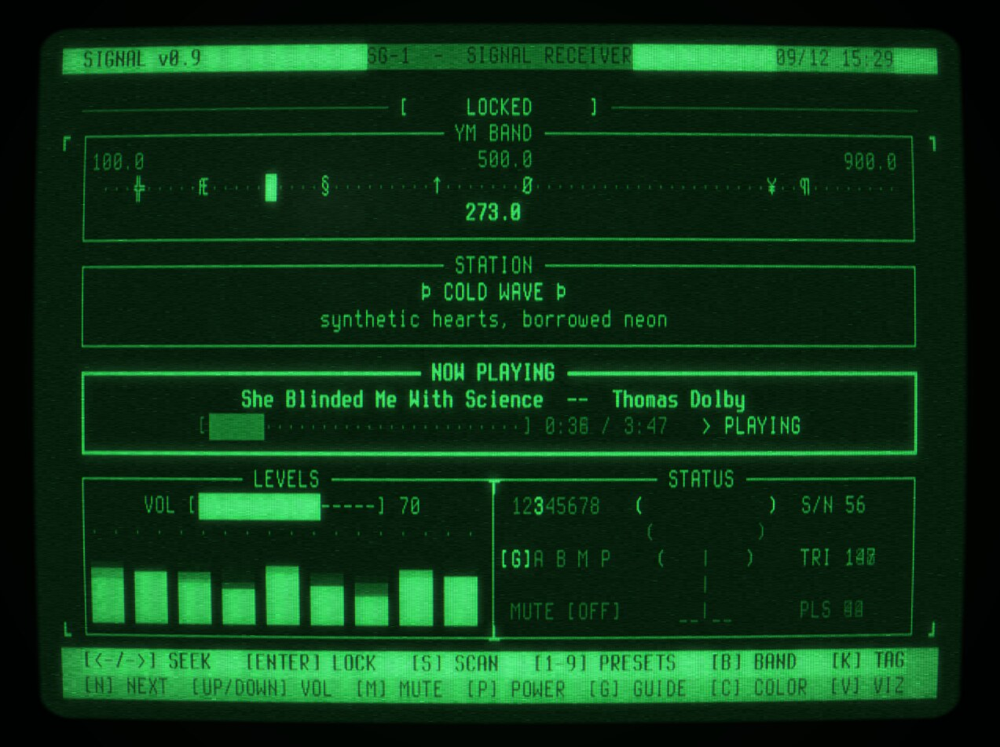
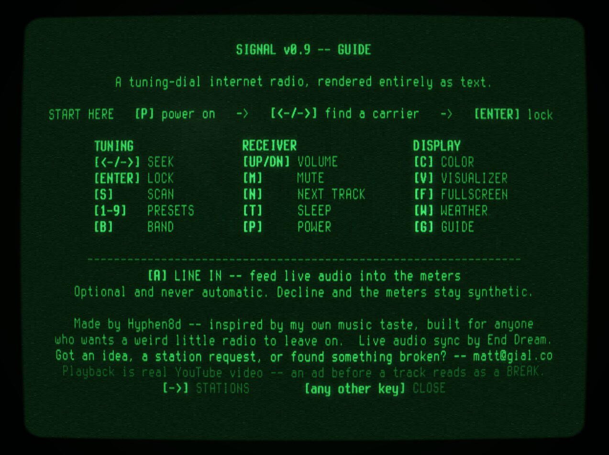
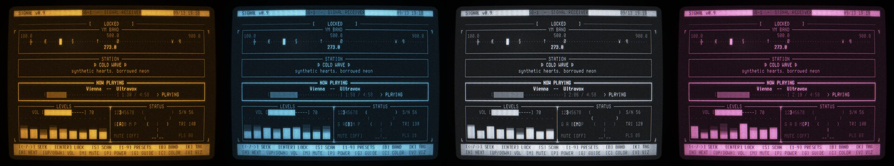
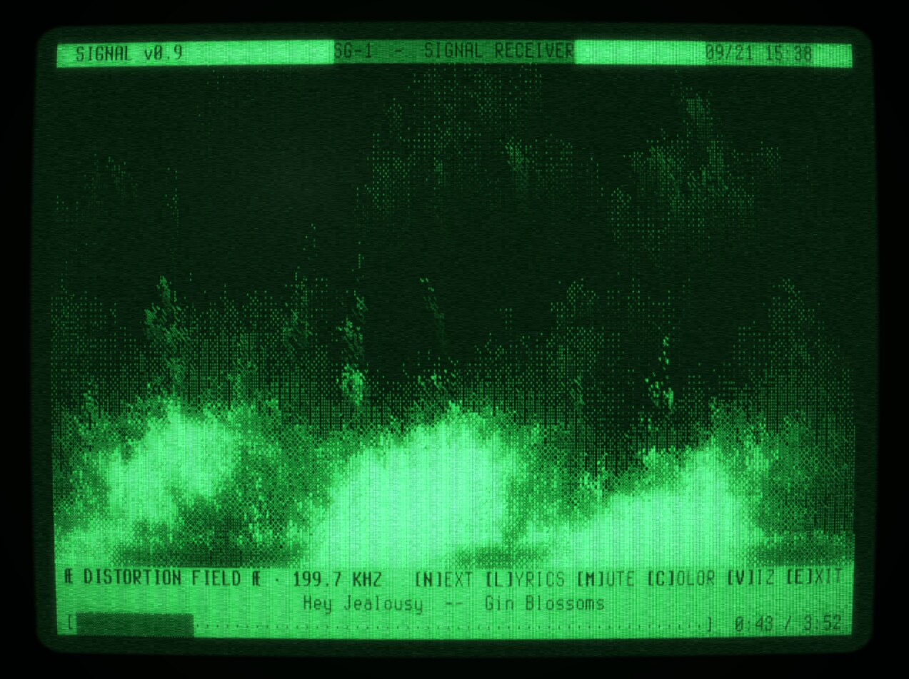

# SIGNAL v0.9

A community-facing, unofficial internet-radio-style web toy: a terminal/CRT
tuning-dial receiver with 9 curated stations, real songs, station idents,
scanning, presets, an ambient tube hum, and a power switch.

Built on top of [`cyberspace-crt`](https://github.com/unremarkablegarden/cyberspace-crt),
the WebGL2 CRT text-grid engine open-sourced from [cyberspace.online](https://cyberspace.online).
**SIGNAL is a standalone project — it is not affiliated with, endorsed by, or
hosted by Cyberspace.** It just uses their engine (MIT licensed) to render a
different program on top of it.



## Try it

**https://hyphen8d.github.io/signal/**

New in 0.9: a full-screen visualizer with its own transport controls for
every station, station-spacing and naming fixes, an audio-autoplay fix, a
hard-mute mode, and a curated track roster. Full history in
[CHANGELOG.md](./CHANGELOG.md). More background and the full controls/station
reference also live on the [wiki](https://github.com/hyphen8d/signal/wiki).

## Screenshots

The in-app guide (`[G]`) -- about, full controls reference, and the station roster:



Five switchable colors (`[C]` to cycle) -- Classic Amber, Cyber Blue, Monochrome, and Bubblegum Pink, on top of the default Green Phosphor above:



The full-screen visualizer (`[V]`), with its own transport controls and a per-station procedural effect -- this one's DISTORTION FIELD's fire:



## The little touches

A tuning-dial radio lives or dies on texture, not just function. A few
things easy to miss from a screenshot alone:

- **The boot sequence** is a ~5.5s retro-BIOS-style POST readout —
  tuner/antenna/preset-table diagnostics in the receiver's own voice, not
  kernel-speak — with the picture visibly warming up in brightness across
  the same window, like a tube actually coming up to temperature.
  Power-down mirrors it in reverse: a signal-loss glitch, the picture
  collapsing to a centerline, then a single dot, then STANDBY.
- **Every station has its own identity**, not just a name and a tracklist:
  a marker on the dial, a distinct musical ident (a short tone motif on
  lock — pitch contour and tempo both vary station to station, so a slow
  ambient station and a punchy synthwave one don't announce themselves at
  the same clip), a static-noise color while you're tuning near it, and its
  own CRT character.
- **The static isn't decorative filler.** Its loudness and pitch both track
  how close you actually are to a station, off the same math the SIG meter
  and the CRT's chroma/snow/roll degrade use — so what you hear, see, and
  read off the meters always agree with each other.
- **Idle imperfection.** Even sitting locked and untouched, the picture
  never looks perfectly static: a slow phosphor shimmer runs constantly
  along the panel borders, and — rarely — a signal briefly rolls or tears,
  like the tuner catching a beat of real-world interference.
- **Text resolves rather than appears.** Callsign, tagline, and track title
  settle out of scrambled noise glyphs over a couple hundred milliseconds
  when you lock or skip, instead of snapping into place.
- **Every control sound is genuine feedback, not garnish** — a relay thunk
  on mute, a volume detent, a keypress click, a thud at the band edges. The
  status row backs all of it up visually too, sweeping and typewriting in
  new text rather than just replacing it.
- **The "would a real radio have this?" rule.** SIGNAL had a play/pause
  button once. It got removed — a real broadcast can't be paused, only
  muted or turned off, and mute already does the honest version of "make it
  stop" without breaking the fiction that the station keeps running whether
  you're listening or not. That test still governs what does and doesn't
  get added.
- **Every station's visualizer is its own procedural effect, not a shared
  template with a palette swap.** A neon wireframe grid whose nodes ignite
  and decay for COLD WAVE, a field of drifting isotope sources for ATOMIC,
  a synthwave sun-and-grid drive (with roadside palm trees and a distant
  skyline) for CIRCUIT CRUSH, a boombox with sound rings, a VU bank and an
  LED ladder for HACKBACK — each one built from the station's own
  identity, not a generic spectrum analyzer wearing nine different colors.
- **The meters and visualizers react to the actual music.** With the audio
  tap live (see "The live audio tap" below), the VU/EQ/FLD readouts and
  every visualizer follow the real signal: the flame flares on bass hits,
  COLD WAVE's grid nodes ignite on the beat, OUTRUN's road drives at the
  track's intensity, and HACKBACK's boombox fires a ring on every real
  onset. Each effect keeps its own identity — the music modulates the
  process, it never replaces it — and without the tap everything falls
  back to the synthetic motion it always had.

## Run it locally

No build step. Clone the repo and serve the directory over HTTP (it won't
work opened directly as a `file://` URL — the font fetch needs a real
origin):

```
python3 tools/dev-server.py 8000
```

Then open `http://localhost:8000`. That server sends `Cache-Control:
no-store` on every response, which matters if you're actively editing —
plain `python3 -m http.server` can serve you a stale cached copy of
`program.js` mid-edit.

**Before pushing a deploy, run `node tools/stamp.js`.** It bumps
`build.json`, the cache-busting stamp `main.js` reads on every load: all the
app modules are imported as `?v=<stamp>`, so a returning visitor gets a
fully consistent fresh build the moment the stamp changes, and a cached one
until then. (Forget it and GitHub Pages' 10-minute cache can keep someone on
the previous build for up to 10 minutes — the window the old per-load `?t=`
bust avoided by making `program.js` uncacheable on every visit.)

There's a headless test suite — no dependencies, just Node:

```
node --test tests/*.test.mjs     # or: npm test
```

`tests/harness.mjs` boots the real program against a real text grid with a
fake clock, so the tests power the set on, open the guide mid-boot, cycle
every visualizer effect, and assert on what's on the grid.

## Controls

| Key | Action |
|---|---|
| `<-` / `->` | Seek |
| `Enter` | Lock onto the nearest station |
| `S` | Scan (auto-sweep, locks when it finds a station) |
| `1`–`9` | Jump straight to a preset station |
| `B` | Back to the previously locked station |
| `N` | Next track on the current station |
| `Up` / `Down` | Volume |
| `M` | Mute |
| `P` | Power off / on |
| `G` | Guide -- about/controls page, a station index, and a full detail page per station (freq/name/description/sample tracks); `<-`/`->` steps through all 11 pages, digits `1`-`9` jump straight to a station's detail page from the index, any other key closes it |
| `C` | Cycle color (Green Phosphor, Classic Amber, Cyber Blue, Monochrome, Bubblegum Pink) |
| `V` | Visualizer -- open a full-screen procedural display while a station is locked (also kicks in on its own after a few minutes idle). Inside it, `C` cycles color, `Shift+C` or `V` cycles the effect itself, `L` opens the synced-lyrics view (`V` or `L` comes back out), `N` skips to the next track, `M` mutes, `Up`/`Down` set volume, `A` re-opens the LINE INPUT card, `F` toggles fullscreen, and a track position bar runs along the bottom; `E` or `Escape` exits -- other keys are no-ops |
| `A` | LINE INPUT -- the audio-capture consent card. Patch a live feed into the meters, or pull it back out. Offered once on your first `[V]`; this key re-opens it on demand, from the main screen or from inside the visualizer |
| `F` | Fullscreen -- toggles the browser's own fullscreen on the page, for running SIGNAL on a spare monitor without browser chrome. Works from the main screen and the visualizer. Note this cannot hide your browser's "sharing this tab" capture indicator if `[A]` is patched in -- that banner belongs to the browser, not the page |

### Touch (mobile)

Below a narrow, portrait, touch-primary viewport, SIGNAL switches to a
compact "lite" layout (its own 42x22 grid and chrome) and touch gets its
own small gesture set rather than the full control surface above:

| Gesture | Action |
|---|---|
| tap | Power on (when off) / mute toggle (when on and locked) |
| swipe left / right | Step to the next / previous station, in dial order |
| swipe up / down | Next track on the current station |
| two-finger tap | Cycle color |

Scan, presets, back, and volume still have no touch equivalent, and the
guide (`[G]`) has no touch trigger to *open* it -- there's also currently
no way to power back *off* on touch alone. Known gaps, not oversights.

## Stations

9 stations, 371 tracks total (30-71 per station -- counts are uneven by design, curation over symmetry -- plus two secret stations carrying 57 more between them). Full roster with taglines and track lists:
[`stations.md`](./stations.md) — generated straight from the live
`STATIONS` array in `stations.js` (`tools/stations-to-md.js`), so it can't
drift from the actual source of truth. Re-run it after editing the station
list:

```
node tools/stations-to-md.js
```

## Content ops

Every track ID in `stations.js` is manually verified against YouTube's oEmbed
endpoint before it's added — never hardcoded on faith. That discipline
matters more now that the repo (and the Pages URL) are public: a dead ID
isn't just an internal annoyance anymore.

- **Adding tracks:** verify via oEmbed first, add to the station's `tracks`
  array, then re-run `node tools/stations-to-md.js` so `stations.md` stays
  in sync. No fixed cadence yet — add as you find good tracks, just don't
  let any one station drop below ~10.
- **Station count:** 9 is the agreed ceiling for now — matches the `1`-`9`
  preset keys cleanly, no spillover digit needed. `0` is not part of the
  public preset scheme; if the roster ever grows past 9, decide how presets
  work deliberately rather than assuming `0` is available. RELIC SIGNAL was
  retired in v0.6 and CIPHER moved into its frequency slot, keeping the
  count at 9.
- **Dead videos:** the player now auto-skips on any playback error (private,
  removed, region-locked, etc.) instead of going silent mid-song — same
  behavior as pressing `[N]` manually. It doesn't retry the same ID or flag
  it anywhere, so a station can quietly lose a track over time. Worth an
  occasional spot-check rather than waiting to notice by ear:

  ```
  node tools/verify-roster.js               # whole roster, secret stations included
  node tools/verify-roster.js --station=atomic   # one station only
  node tools/lint-roster.js                 # offline: the rules below, no network
  ```

  Checks every track ID against oEmbed and prints any that are now dead,
  private, or region/embed-restricted, with a nonzero exit code if anything
  failed (so it's CI/cron-friendly if that's ever wanted). It runs the
  offline rules first — station count, track minimums, ident length, dial
  glyphs present in the font, `visual` keys that exist, unique IDs and
  frequency spacing — and `tests/roster.test.mjs` asserts the same rules,
  so `npm test` catches a malformed roster before it ships.
- **Concept-tied stations:** if a station's premise points at a real source
  (e.g. ATOMIC being an in-universe Fallout radio station), verify tracks
  against *that* source's actual tracklist, not just oEmbed -- oEmbed only
  confirms a video is real and embeddable, not that it's actually the song
  the station claims to be playing. ATOMIC shipped with 5 tracks that were
  genuine oldies but never actually on Fallout's Diamond City/Appalachia
  Radio before this got caught and fixed.
- **Taglines:** they're reused verbatim in the guide's station index
  (`[G]` -> `->`), one line per station with the callsign in front, so the
  real limit is **52 minus the callsign's length** (35 is always safe;
  `tools/lint-roster.js` checks the exact fit). The STATION box on the main
  screen and the mobile layout have more room than that.

## How it's built

- `program.js` — the state machine: the frame-driven effects queue, init,
  power on/off, the YouTube player, tuning/lock, scan/presets, and input.
  Implements the engine's `{ init, frame, key, keyUp }` program contract,
  plus `{ onTouchStart, onTouchEnd }` for the mobile gesture set, and
  composes the rest of the app from mixins:
  - `ui/desktop.js` / `ui/mobile.js` / `ui/guide.js` — the 80x25 screen,
    the 42x22 mobile-lite screen and its gestures, and the `[G]` guide.
  - `visualizer.js` + `visuals/<effect>.js` — the full-screen visualizer
    shell and one module per effect (`{ key, label, init, reset, draw }`,
    registered in `visuals/index.js` in `[V]`-cycle order).
  - `audio/sfx.js` (synthesized control sounds, static bed, hum, the
    hard-mute speaker bus), `audio/voice.js` (station IDs, liners, lyrics
    lookup), `audio/tap.js` (the live audio tap and `AUDIO_BUS`).
  - `stations.js` (the roster — pure data), `layout.js` (grid geometry and
    text helpers), `tuning.js` (the band and the nearest-station model),
    `crt-hooks.js` (live `crt.params` drives), `constants.js`, `state.js`.
  Every app module imports its siblings as `?v=<build stamp>` — see
  `main.js` — so a deploy can never mix a fresh module with a stale one.
- `src/` — the `cyberspace-crt` engine itself (WebGL2 renderer, CRT shader
  passes, the text grid with per-row damage tracking, bitmap font parser).
- `config.js` — tunable CRT/render parameters, phosphor tints, and
  `MOBILE_LITE`: an off-detection check (coarse pointer + narrow portrait)
  that swaps the grid from the desktop 80x25 down to a compact 42x22 for
  phones, with its own chrome/status-row drawing paths in `program.js`.
- `index.html` / `main.js` — thin bootstrap that mounts the engine and hands
  it `program.js`.
- `fonts/` — Terminus bitmap font (SIL OFL 1.1, separate from the MIT
  license below — see `LICENSE`).
- `tools/` — dev server, the build-stamp bumper, the roster doc generator
  and roster checks, and `network.html` (a roster-editing dashboard).
- `tests/` — the headless harness and the test suite.

Playback is real YouTube video via the IFrame API, audio-only in practice —
the player is docked off-screen since the terminal is the only visible UI.
Because of that, listeners without YouTube Premium may see a YouTube ad
before a track starts — that's YouTube's embed behavior, not something
SIGNAL controls or attempts to suppress. The in-app Guide (`[G]`) says so.

**The live audio tap.** Browsers won't let a page read audio out of a
cross-origin iframe, so the meters/visualizers get their signal by
capturing it outside the player instead. **SIGNAL never raises a capture
prompt on its own.** The first time you press `[V]` for the visualizer it
shows a LINE INPUT card in its own chrome — what the browser is about to
ask, what the signal is used for, and that saying no costs nothing — and
only a deliberate `[Y]` there raises the dialog. `[A]` re-opens that card
any time, to patch the tap in later or pull it back out.

On desktop Chrome/Edge the card raises a tab-share picker (choose "This
tab", tick "Also share tab audio"; the status row then reports `TAP:
LINE`). On other desktop browsers it asks for the microphone instead,
which hears the music through your speakers (`TAP: MIC`) — that grant is
remembered by the browser, so later visits start it silently with no card
and no dialog. Declining stops there: it never escalates from one prompt
to another. Every meter and visualizer simply keeps the synthetic
animation it always had, which is what the app looks like by default.

Mobile doesn't ask at all. Its only use for the tap is the shape of the VU
trace, which isn't worth a microphone permission; an already-granted mic
from an older build still resumes silently.

The capture is analysis-only — it feeds an AnalyserNode and nothing else,
nothing is recorded, and nothing leaves the page.

One thing does leave the page, and it's unrelated to the tap: the
visualizer's `[L]` synced-lyrics view looks each track up on
[LRCLIB](https://lrclib.net) by title and artist when the track loads, so
that service sees what's playing. No account, no key, nothing else sent.

## Credits

The live audio tap, and the visualizer audio-sync work it drives — the
meters and every full-screen effect reacting to the real playing track —
is the work of **End Dream**.

## License

MIT — see `LICENSE`. The bitmap fonts in `fonts/` are separately licensed
(SIL Open Font License 1.1); see `fonts/OFL.txt`.
